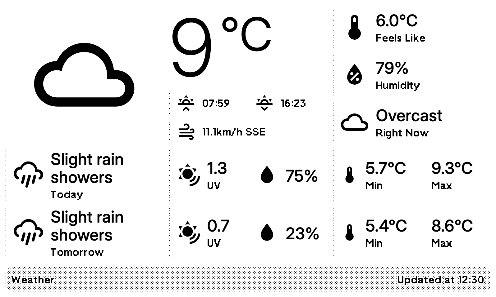

# TRMNL Home Assistant Entities

Yet another weather plugin for a [TRMNL](https://usetrmnl.com) device.

The layout is ~stolen from~ strongly based on the [TRMNL Weather](https://usetrmnl.com/integrations/weather) plugin; however, it's written as a normal extension and hence usable on BYOS instances.

The data is sourced from [Open-Meteo](https://open-meteo.com).



## Prerequisites

You'll need:

* Your latitude and longitude coordinates, which you can find using a service such as [LatLong](https://www.latlong.net/).

## Running Locally

You'll need Ruby to run [trmnl-preview](https://github.com/usetrmnl/trmnlp) or Docker.

```bash
bin/trmnlp serve
```

## Attributions

The data feed is from [Open-Meteo](https://open-meteo.com).

The icons used are [from the Material Design icons](https://github.com/Templarian/MaterialDesign/blob/master/LICENSE).
